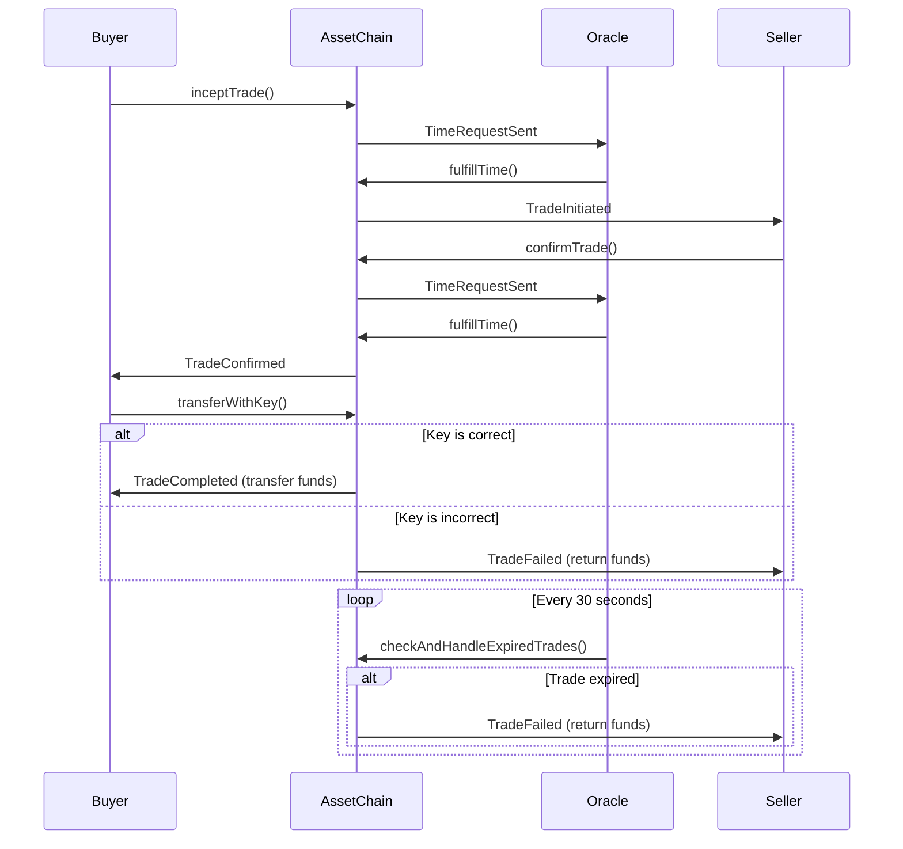

# AssetChain 和 Timer_oracle 系統介紹

## 智能合約：AssetChain（ 以在以太坊運行的 HTLC 為例 ）

### 時序圖


### 合約結構

1. **狀態變數**：
   ```solidity
   address private oracle;
   mapping(uint => Trade) public trades;
   mapping(bytes32 => uint) private requestToTradeId;
   uint[] public tradeIds;
   ```
   
   詳細解釋：
   - `oracle`：儲存 Time Oracle 服務的以太坊地址。這個地址有權限執行某些特定的函數。
   - `trades`：一個 mapping，用交易 ID 作為 key，儲存 `Trade` 結構裡面。可以快速查詢和更新特定交易的詳細資訊。
   - `requestToTradeId`：將 Oracle 請求的 ID mapping 到交易 ID。可以讓 Oracle 快速找到相對應的交易。
   - `tradeIds`：儲存所有 active （還沒完成或尚未失敗取消）交易 ID 的 list。可以找到所有交易。

2. **交易結構**：
   ```solidity
   struct Trade {
       uint id;
       uint256 amount;
       address payable buyer;
       address payable seller;
       string keyEncryptedSeller;
       string keyEncryptedBuyer;
       uint256 inceptionTime;
       uint256 confirmationTime;
       uint256 duration;
       uint256 lastOracleUpdate;
       TradeState state;
   }
   ```
   
   詳細解釋：
   - `id`：交易的唯一 primary key。
   - `amount`：交易金額 (wei)。
   - `buyer` 和 `seller`：買家和賣家的以太坊地址。設置為 `payable` 以允許發送以太幣至合約。
   - `keyEncryptedSeller` 和 `keyEncryptedBuyer`：加密的秘密，原本跨鏈的 HTLC 用於交易的確認。
   - `inceptionTime` 和 `confirmationTime`：交易開始和確認的時間戳。
   - `duration`：交易的有效期限（秒）。
   - `lastOracleUpdate`：交易的最後存入的時間戳。
   - `state`：交易的當前狀態，使用 `TradeState`。

3. **Enum 枚舉**：
   ```solidity
   enum TradeState { Initiated, AwaitingConfirmation, Confirmed, Completed, Failed }
   ```
   
   詳細解釋：
   - `Initiated`：交易已初始化，但尚未得到 Oracle 的時間確認。
   - `AwaitingConfirmation`：等待賣家確認交易。
   - `Confirmed`：賣家已確認交易，等待買家提供 key。
   - `Completed`：交易成功完成。
   - `Failed`：交易因某種原因失敗（如超時或密鑰錯誤）。

### 主要功能

1. **inceptTrade**：
   ```solidity
   function inceptTrade(uint id, uint256 amount, address payable seller, string memory keyEncryptedSeller, uint256 duration) public {
       require(trades[id].id == 0, "Trade ID already exists");
       trades[id] = Trade(id, amount, payable(msg.sender), seller, keyEncryptedSeller, "", 0, 0, duration, 0, TradeState.Initiated);
       tradeIds.push(id);
       
       bytes32 requestId = keccak256(abi.encodePacked(block.timestamp, id));
       requestToTradeId[requestId] = id;
       emit TradeInitiated(id, amount, msg.sender, seller, duration);
       emit TimeRequestSent(requestId, id, duration);
   }
   ```
   
   詳細解釋：
   - 首先檢查給定的 ID 是否已存在，如果存在則拋出錯誤。
   - 創建一個新的 `Trade` 結構，設置初始時間戳記為 `lastOracleUpdate = 0` 、狀態為 `Initiated`。
   - 將新的交易 ID 添加到 `tradeIds` list 裡面。
   - 生成一個唯一的 `requestId`，用於 Oracle 請求。這裡使用當前時間戳和交易 ID 的組合來確保唯一性。
   - 將 `requestId` mapping 到交易 ID，以便後續處理。
   - 觸發 `TradeInitiated` 事件，通知前端( 未來可能會需要一個 )或其他監聽者交易已創建。
   - 觸發 `TimeRequestSent` 事件，請求 Oracle 服務提供時間戳。

2. **confirmTrade**：
   ```solidity
   function confirmTrade(uint id, uint256 amount, address payable buyer, string memory keyEncryptedBuyer) public payable {
       require(trades[id].id != 0, "Trade ID does not exist");
       require(trades[id].seller == msg.sender, "Only the seller can confirm the trade");
       require(trades[id].buyer == buyer, "Buyer address does not match");
       require(trades[id].amount == amount, "Amount does not match");
       require(msg.value == amount, "Incorrect deposit amount");
       require(trades[id].state == TradeState.AwaitingConfirmation, "Trade is not in the correct state");

       trades[id].keyEncryptedBuyer = keyEncryptedBuyer;
       trades[id].state = TradeState.Confirmed;
       
       bytes32 requestId = keccak256(abi.encodePacked(block.timestamp, id));
       requestToTradeId[requestId] = id;
       emit TradeConfirmationReceived(id, amount, msg.sender);
       emit TimeRequestSent(requestId, id, trades[id].duration);
       emit TradeConfirmed(id);
   }
   ```
   
   詳細解釋：
   - 進行一系列的檢查，確保：
     1. 交易存在
     2. 調用這個 function 的是賣家
     3. 買家地址是否匹配
     4. 確認金額是否正確
     5. 確認賣家是否存入了正確的金額
     6. 交易處於正確的狀態（等待確認）
   - 更新交易資訊，設置買家的加密密鑰並將狀態更改為 `Confirmed`。
   - 生成新的 `requestId` 並建立 mapping。
   - 觸發多個事件：
     1. `TradeConfirmationReceived`：通知系統賣家已確認交易。
     2. `TimeRequestSent`：再次請求 Oracle 提供時間戳。
     3. `TradeConfirmed`：請求時間戳之後再次通知系統交易已被確認。

3. **fulfillTime**：
   ```solidity
   function fulfillTime(bytes32 _requestId, uint256 _timestamp) external onlyOracle {
       uint tradeId = requestToTradeId[_requestId];
       require(tradeId != 0, "Invalid request ID");
       
       Trade storage trade = trades[tradeId];
       require(trade.state != TradeState.Completed && trade.state != TradeState.Failed, "Trade already completed or failed");

       emit TimeRequestFulfilled(tradeId, _timestamp);
       
       trade.lastOracleUpdate = _timestamp; 
       
       if (trade.inceptionTime == 0) {
           trade.inceptionTime = _timestamp;
           trade.state = TradeState.AwaitingConfirmation;
       } else if (trade.state == TradeState.Confirmed) {
           trade.confirmationTime = _timestamp;
           if (_timestamp - trade.inceptionTime <= trade.duration) {
               emit TradeCompletionAttempted(tradeId, true, "Within time limit");
           } else {
               emit TradeCompletionAttempted(tradeId, false, "Time limit exceeded");
               failTrade(tradeId, "Time limit exceeded");
           }
       }
   }
   ```
   
   詳細解釋：
   - 這個函數只能由 Oracle 調用（由 `onlyOracle` 保證）。
   - 首先，通過 `requestId` 找到對應的交易 ID。
   - 檢查交易是否存在且尚未完成或失敗。
   - 觸發 `TimeRequestFulfilled` 事件，表示 Oracle 已提供時間戳。
   - `trade.lastOracleUpdate = _timestamp;` 更新 time stamp
   - 根據交易的當前狀態進行不同的處理：
     1. 如果 `inceptionTime` 為 0（首次設置時間），設置交易開始時間並將狀態更改為 `AwaitingConfirmation`。
     2. 如果交易狀態為 `Confirmed`，設置確認時間並檢查是否在有效期內：
        - 如果在有效期內，觸發 `TradeCompletionAttempted` 事件（成功）。
        - 如果超出有效期，觸發 `TradeCompletionAttempted` 事件（失敗）並調用 `failTrade` 函數。
        - ```solidity
            function failTrade(uint id, string memory reason) internal {
                Trade storage trade = trades[id];
                require(trade.state != TradeState.Completed && trade.state != TradeState.Failed, "Trade already completed or failed");

                // 如果交易已確認且賣家已存入資金，則退回資金
                if (trade.state == TradeState.Confirmed) {
                    uint256 amountToReturn = trade.amount;
                    trade.amount = 0; // 防止重入攻擊
                    (bool sent, ) = trade.seller.call{value: amountToReturn}("");
                    if (sent) {
                        emit AssetReturned(id, trade.seller, amountToReturn);
                    } else {
                        trade.amount = amountToReturn; // 如果退款失敗，恢復金額
                        emit AssetReturned(id, trade.seller, 0);
                    }
                    require(sent, "Failed to return asset to seller");
                }

                trade.state = TradeState.Failed;
                emit TradeFailed(id, reason);
                removeTrade(id);
            }
            ```
            
        - 重入攻擊是指攻擊者在接收以太幣的過程中，利用回調函數（fallback function）重複調用發送方的函數，在狀態更新前重複提取資金的攻擊方式。
            - 2016 年的 DAO 攻擊就是一個著名的重入攻擊案例，導致了約 6000 萬美元的損失，最終引發了以太坊的硬分叉。

4. **transferWithKey**：
   ```solidity
   function transferWithKey(uint id, string memory key) public {
       require(trades[id].state == TradeState.Confirmed, "Trade is not in the correct state");
       require(trades[id].buyer == msg.sender, "Only the buyer can initiate the transfer");
       require(trades[id].confirmationTime != 0, "Confirmation time not set");
       require(trades[id].lastOracleUpdate - trades[id].confirmationTime <= trades[id].duration, "Trade duration exceeded");
       
       Trade storage trade = trades[id];

       if (keccak256(abi.encodePacked(key)) == keccak256(abi.encodePacked(trade.keyEncryptedSeller))) {
           completeTrade(id);
       } else {
           failTrade(id, "Invalid key provided");
       }
   }
   ```
   
   詳細解釋：
   - 首先進行一系列檢查：
     1. 確保交易狀態為 `Confirmed`。
     2. 確保調用者是買家。
     3. 確保確認時間已設置。
     4. 確保當前時間在交易有效期內。
   - 比較買家提供的密鑰與存儲的加密賣家密鑰是否匹配：
     - 如果匹配，調用 `completeTrade` 函數完成交易。
     - 如果不匹配，調用 `failTrade` 函數使交易失敗。

## Oracle 服務：Node.js 應用程式

### 主要功能

1. **初始化**：
   ```javascript
   async function initializeEthers() {
       provider = new ethers.JsonRpcProvider(ETHEREUM_NODE_URL);
       signer = new ethers.Wallet(PRIVATE_KEY, provider);
       contract = new ethers.Contract(CONTRACT_ADDRESS, contractABI, signer);
       lastProcessedBlock = await provider.getBlockNumber();
       currentNonce = await provider.getTransactionCount(signer.address);
       log(`Initialized with contract: ${CONTRACT_ADDRESS}`);
   }
   ```
   
   詳細解釋：
   - 創建一個 `JsonRpcProvider` ，用於與以太坊節點通信。
       - `ETHEREUM_NODE_URL="https://1rpc.io/sepolia"`
   - 使用私鑰創建一個 `Wallet` ，這將用於簽署交易。（我有存私鑰在 `.env` 裡面）
   - 創建一個變數並提供合約地址，存在 `.env` 裡面。
   - 獲取最新的區塊號碼，用於後續定時獲取事件。
   - 獲取當前的 [nonce（交易計數器）](https://hackmd.io/@CryptoPoYang/BJMQcx4e1e)，用於發送交易，且確保不要重複發送。
   - 記錄初始化完成的資訊。

2. **事件監聽**：
   ```javascript
   async function pollEvents() {
       try {
           const latestBlock = await provider.getBlockNumber();
           if (latestBlock <= lastProcessedBlock) {
               return; // No new blocks
           }

           log(`Checking for events from block ${lastProcessedBlock + 1} to ${latestBlock}`);

           const filter = contract.filters.TimeRequestSent();
           const events = await contract.queryFilter(filter, lastProcessedBlock + 1, latestBlock);

           for (const event of events) {
               const { requestId, tradeId, duration } = event.args;
               const eventTimestamp = (await event.getBlock()).timestamp;
               log(`Received TimeRequestSent event for trade ${tradeId}`);
               if (!processingTrades.has(tradeId.toString())) {
                   handleTimeRequest(requestId, tradeId.toString(), duration, eventTimestamp)
                       .catch(error => log(`Error processing event: ${error.message}`));
               } else {
                   eventQueue.push({ requestId, tradeId: tradeId.toString(), duration, eventTimestamp });
                   log(`Trade ${tradeId} is being processed, event queued`);
               }
           }

           lastProcessedBlock = latestBlock;
       } catch (error) {
           log(`Error polling events: ${error.message}`);
       }
   }
   ```
   
   詳細解釋：
   - 獲取最新的區塊號碼，檢查是否有新的區塊。
   - 如果有新區塊，創建一個事件過濾器來查找 `TimeRequestSent` 事件。
   - 使用 `queryFilter` 獲取指定區塊範圍內的所有相關事件。
   - 對每個事件：
     1. 解構事件變數，獲取 `requestId`、`tradeId` 和 `duration`。
     2. 獲取事件所在區塊的時間戳。
     3. 檢查該交易是否正在處理中：
        - 如果不在處理中，調用 `handleTimeRequest` 函數處理事件。
        - 如果正在處理中，將事件添加到 queue 中等待後續處理。
   - 更新最後處理的區塊號碼。

3. **時間戳管理**：
   ```javascript
   async function handleTimeRequest(requestId, tradeId, duration, eventTimestamp) {
       if (processingTrades.has(tradeId)) {
           log(`Trade ${tradeId} is currently being processed, queueing this request`);
           eventQueue.push({ requestId, tradeId, duration, eventTimestamp });
           return;
       }

       processingTrades.add(tradeId);
       
       try {
           const currentTime = Math.floor(Date.now() / 1000);
           
           if (!trades.has(tradeId)) {
               trades.set(tradeId, { 
                   inceptionTime: eventTimestamp, 
                   duration: Number(duration),
                   lastRequestId: requestId,
                   lastRequestTime: eventTimestamp
               });
               await fulfillTime(requestId, eventTimestamp);
               log(`Inception time set for trade ${tradeId}`);
           } else {
               const trade = trades.get(tradeId);
               if (currentTime - trade.inceptionTime <= trade.duration) {
                   trade.lastRequestId = requestId;
                   trade.lastRequestTime = eventTimestamp;
                   await fulfillTime(requestId, eventTimestamp);
                   log(`Confirmation time set for trade ${tradeId}`);
               } else {
                   await handleFailedConfirmation(tradeId);
                   log(`Failed confirmation for trade ${tradeId} due to exceeded duration`);
                   trades.delete(tradeId);
               }
           }
       } catch (error) {
           log(`Error processing trade ${tradeId}: ${error.message}`);
       } finally {
           processingTrades.delete(tradeId);
           processNextEvent();
       }
   }
   ```
   
   詳細解釋：
   - 首先檢查該交易是否正在處理中。如果是，將請求加入 queue 就離開此函數。
   - 將交易標記為正在處理中。
   - 獲取當前時間戳。
   - 檢查交易是否已存在於本地記錄中：
     - 如果不存在，創建新的交易記錄，設置初始時間，並調用 `fulfillTime` 函數更新智能合約。
     - 如果已存在：
       - 檢查是否在有效期內。如果是，更新最後請求資訊並調用 `fulfillTime`。
       - 如果超出有效期，調用 `handleFailedConfirmation` 處理失敗的交易。
   - 無論處理結果如何，最後都會從處理中列表移除該交易，並處理 queue 中的下一個事件。

### 錯誤處理和重試機制

1. **Nonce 管理**：
   ```javascript
   async function fulfillTime(requestId, timestamp) {
       try {
           const tx = await contract.fulfillTime(requestId, timestamp, {
               nonce: currentNonce++,
               gasLimit: 200000 // Adjust as needed
           });
           await tx.wait();
           log(`Fulfilled time for request ${requestId}`);
       } catch (error) {
           if (error.message.includes('nonce too low')) {
               currentNonce = await provider.getTransactionCount(signer.address);
               log(`Nonce reset to ${currentNonce}`);
               // Retry the transaction
               return fulfillTime(requestId, timestamp);
           }
           throw error;
       }
   }
   ```
   
   詳細解釋：
   - 嘗試調用智能合約的 `fulfillTime` 函數，提供 `requestId` 和 `timestamp`。
   - 使用當前的 `nonce` 值發送交易，並在發送後遞增 `nonce`。
   - 設置 `gasLimit` 以確保交易有足夠的 gas 執行。
   - 等待交易被確認（`tx.wait()`）。
   - 如果遇到 "nonce too low" 錯誤（可能由於其他交易導致 nonce 不同步）：
     - 從區塊鏈獲取最新的 nonce 值。
     - 遞迴調用 `fulfillTime` 函數重試交易。
   - 其他錯誤則拋出異常。

2. **隊列處理**：
   ```javascript
   function processNextEvent() {
       if (eventQueue.length > 0) {
           const nextEvent = eventQueue.shift();
           handleTimeRequest(nextEvent.requestId, nextEvent.tradeId, nextEvent.duration, nextEvent.eventTimestamp)
               .catch(error => log(`Error processing queued event: ${error.message}`));
       }
   }
   ```
   
   詳細解釋：
   - 檢查事件隊列是否有待處理的事件。
   - 如果有，從隊列中取出第一個事件（使用 `shift()` 方法）。
   - 調用 `handleTimeRequest` 函數處理該事件。
   - 如果處理過程中發生錯誤，記錄錯誤資訊但不中斷程序執行。

3. **定期檢查過期交易（願景但尚未測試）**：
   ```javascript
   async function checkAndHandleExpiredTrades() {
       const currentTime = Math.floor(Date.now() / 1000);
       for (const [tradeId, trade] of trades.entries()) {
           if (currentTime - trade.inceptionTime > trade.duration && !processingTrades.has(tradeId)) {
               processingTrades.add(tradeId);
               try {
                   await handleFailedConfirmation(tradeId);
                   log(`Handled expired trade ${tradeId}`);
                   trades.delete(tradeId);
               } catch (error) {
                   log(`Error handling expired trade ${tradeId}: ${error.message}`);
               } finally {
                   processingTrades.delete(tradeId);
               }
           }
       }
   }
   ```
   
   詳細解釋：
   - 獲取當前時間戳。
   - 遍歷所有記錄的交易。
   - 對於每個交易，檢查是否已過期（當前時間減去開始時間大於持續時間）且不在處理中。
   - 如果交易過期：
     - 將交易標記為處理中。
     - 調用 `handleFailedConfirmation` 函數處理失敗的交易。
     - 從本地記錄中刪除該交易。
   - 無論處理是否成功，最後都從處理中列表移除該交易。

## 系統整合

智能合約和 Oracle 服務通過以下方式進行交互：

1. **事件監聽**：Oracle 服務通過 `pollEvents` 函數定期檢查智能合約發出的 `TimeRequestSent` 事件。

2. **時間戳更新**：Oracle 服務通過調用智能合約的 `fulfillTime` 函數來更新交易的時間戳。

3. **失敗處理**：對於過期或失敗的交易，Oracle 服務調用智能合約的 `handleFailedConfirmation` 函數。

4. **並發控制**：Oracle 服務使用本地的 `processingTrades` 集合和 `eventQueue` 隊列來管理並發請求，確保每個交易都被正確處理。

5. **錯誤恢復**：通過 nonce 管理和重試機制，Oracle 服務能夠處理由於網絡延遲或其他原因導致的交易失敗。

## 結論

AssetChain 和其配套的 Oracle 服務共同構建了一個去中心化的資產交易系統。通過智能合約確保交易的安全性和透明度，同時利用 Oracle 服務提供必要的鏈下數據和邏輯處理。

1. **智能合約（AssetChain）** 負責：
   - 定義交易結構和狀態
   - 實現核心業務邏輯（如交易初始化、確認和完成）
   - 管理交易的生命週期
   - 發出事件以通知外部系統

2. **Oracle 服務**負責：
   - 監聽智能合約事件
   - 提供準確的時間戳資訊
   - 處理交易的時間相關邏輯
   - 管理並發和錯誤恢復

## 有成功的 log 


```log=
> contracttimesender@1.0.0 start
> node server_new.js

2024-10-21T16:02:41.133Z - Initialized with contract: 0x8e7B8A5b4AC4103C6FF2eaFf096043712f78BCCF
2024-10-21T16:02:41.146Z - Server running on port 3000
2024-10-21T16:02:55.408Z - Checking for events from block 6917212 to 6917212
2024-10-21T16:03:10.460Z - Checking for events from block 6917213 to 6917214
2024-10-21T16:03:11.597Z - Received TimeRequestSent event for trade 12
2024-10-21T16:03:25.395Z - Checking for events from block 6917215 to 6917215
2024-10-21T16:03:40.415Z - Checking for events from block 6917216 to 6917216
2024-10-21T16:04:03.501Z - Fulfilled time for request 0x39a5b882edc1ec1c36affced7111fc24d98d5cfb396c8015c609f71427aa8661
2024-10-21T16:04:03.501Z - Inception time set for trade 12
2024-10-21T16:04:10.404Z - Checking for events from block 6917217 to 6917218
2024-10-21T16:04:25.399Z - Checking for events from block 6917219 to 6917219
2024-10-21T16:04:38.730Z - Handled failed confirmation for trade 12
2024-10-21T16:04:38.731Z - Handled expired trade 12
2024-10-21T16:04:40.404Z - Checking for events from block 6917220 to 6917220
2024-10-21T16:04:56.076Z - Checking for events from block 6917221 to 6917221
```

```log=
> contracttimesender@1.0.0 start
> node server_new.js

2024-10-21T16:05:47.868Z - Initialized with contract: 0x8e7B8A5b4AC4103C6FF2eaFf096043712f78BCCF
2024-10-21T16:05:47.883Z - Server running on port 3000
2024-10-21T16:06:02.254Z - Checking for events from block 6917226 to 6917228
2024-10-21T16:06:17.224Z - Checking for events from block 6917229 to 6917229
2024-10-21T16:06:18.453Z - Received TimeRequestSent event for trade 12
2024-10-21T16:07:02.233Z - Checking for events from block 6917230 to 6917230
2024-10-21T16:07:09.161Z - Fulfilled time for request 0x18aa4f3c9ed2cf3ab5efa388498050bde776b06894200491d33bb53294d3bdeb
2024-10-21T16:07:09.161Z - Inception time set for trade 12
2024-10-21T16:07:17.237Z - Checking for events from block 6917231 to 6917231
2024-10-21T16:07:32.220Z - Checking for events from block 6917232 to 6917232
2024-10-21T16:07:34.325Z - Received TimeRequestSent event for trade 12
2024-10-21T16:07:47.797Z - Checking for events from block 6917233 to 6917233
2024-10-21T16:07:57.297Z - Fulfilled time for request 0x074971605e8cc4c0366b1f969519f3adbcf55fb6cd6b4e0c7e1da2f09cfd4ed6
2024-10-21T16:07:57.297Z - Confirmation time set for trade 12
2024-10-21T16:08:02.320Z - Checking for events from block 6917234 to 6917234
2024-10-21T16:08:17.224Z - Checking for events from block 6917235 to 6917235
2024-10-21T16:08:32.284Z - Checking for events from block 6917236 to 6917237
2024-10-21T16:08:47.213Z - Checking for events from block 6917238 to 6917238
2024-10-21T16:09:02.251Z - Checking for events from block 6917239 to 6917239
2024-10-21T16:09:33.179Z - Checking for events from block 6917240 to 6917240
2024-10-21T16:09:38.830Z - Error handling expired trade 12: transaction execution reverted (action="sendTransaction", data=null, reason=null, invocation=null, revert=null, transaction={ "data": "", "from": "0x996c7C5F6626adF15A5fcA4f7f5B6550Cd2e00E2", "to": "0x8e7B8A5b4AC4103C6FF2eaFf096043712f78BCCF" }, receipt={ "_type": "TransactionReceipt", "blobGasPrice": null, "blobGasUsed": null, "blockHash": "0x1013a265abc5abebd32541143e21dac2d87233f2347d442b8c1ab72eaf7283d4", "blockNumber": 6917241, "contractAddress": null, "cumulativeGasUsed": "11867496", "from": "0x996c7C5F6626adF15A5fcA4f7f5B6550Cd2e00E2", "gasPrice": "3490324116", "gasUsed": "26257", "hash": "0xfc20621786207374b9539ea0eedc0bb829cf5832cb6115e1790bed75f086d5b4", "index": 64, "logs": [  ], "logsBloom": "0x00000000000000000000000000000000000000000000000000000000000000000000000000000000000000000000000000000000000000000000000000000000000000000000000000000000000000000000000000000000000000000000000000000000000000000000000000000000000000000000000000000000000000000000000000000000000000000000000000000000000000000000000000000000000000000000000000000000000000000000000000000000000000000000000000000000000000000000000000000000000000000000000000000000000000000000000000000000000000000000000000000000000000000000000000000000", "root": null, "status": 0, "to": "0x8e7B8A5b4AC4103C6FF2eaFf096043712f78BCCF" }, code=CALL_EXCEPTION, version=6.13.3)
2024-10-21T16:09:47.224Z - Checking for events from block 6917241 to 6917242
2024-10-21T16:10:02.251Z - Checking for events from block 6917243 to 6917243
```