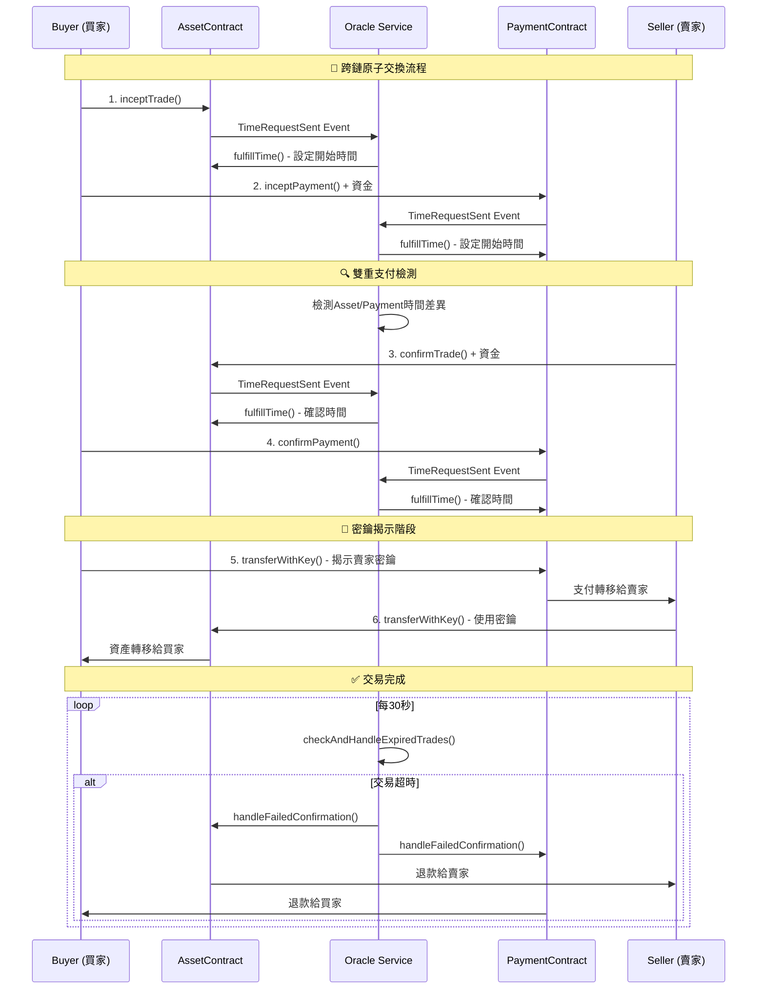

# 跨鏈原子交換時間Oracle系統

一個基於以太坊的跨鏈原子交換（Atomic Swap）系統，具備時間Oracle服務、防雙重支付攻擊和完整超時保護機制。

## 🌟 專案特色

- **🔗 跨鏈原子交換**: 支援Asset鏈和Payment鏈之間的安全資產交換
- **⏰ 時間Oracle服務**: 提供準確的時間戳管理和超時監控
- **🛡️ 雙重支付防護**: 即時檢測並阻止雙重支付攻擊
- **🔒 多階段超時保護**: 完整的超時處理機制，確保資金安全
- **🧪 全面測試套件**: 包含壓力測試、超時測試和安全性測試

## 📁 專案結構

```
contractTimeSender/
├── contract/                    # 智能合約
│   ├── assetContract.sol       # 資產交易合約
│   └── paymentContract.sol     # 支付交易合約
├── backend/                     # 後端服務
│   ├── server.js               # 主要Oracle服務器
│   ├── services/
│   │   └── logger.js           # 日誌記錄服務
│   └── test/                   # 測試套件
│       ├── autoTest.js         # 自動化測試
│       ├── stressTest.js       # 壓力測試
│       ├── run_timeout_tests.js # 超時測試
│       ├── TIMEOUT_TESTS_README.md
│       └── TIMEOUT_FIXES_SUMMARY.md
├── script/
│   └── test.sh                 # 測試執行腳本
├── package.json
└── README.md
```

## 🏗️ 系統架構

### 智能合約層

#### AssetContract.sol
負責資產鏈的交易管理：
- 交易生命週期管理（Initiated → AwaitingConfirmation → Confirmed → Completed/Failed）
- 密鑰驗證和資產轉移
- 防重入攻擊保護
- 超時自動退款機制

#### PaymentContract.sol
負責支付鏈的交易管理：
- 支付確認和管理
- 跨鏈交易關聯（assetTradeId）
- 自動退款保護
- 執行階段超時處理

### Oracle服務層

#### 核心功能
- **事件監聽**: 實時監聽兩條鏈的`TimeRequestSent`事件
- **時間戳管理**: 提供準確的時間戳給智能合約
- **跨鏈同步**: 協調Asset和Payment鏈的交易狀態
- **風險檢測**: 即時檢測雙重支付和時間同步風險

#### 防護機制
```javascript
// 雙重支付檢測
async function performImmediateDoubleSpendCheck(assetTradeId, paymentId, assetDuration, paymentDuration) {
    if (assetDuration < paymentDuration) {
        // 立即取消交易，防止攻擊
        await cancelBothTrades(assetTradeId, paymentId);
    }
}
```

## 🔄 交易流程



## 🛡️ 安全機制

### 1. 多階段超時保護

#### 創建階段超時（Timeout 1）
- **觸發條件**: 創建交易後長期無後續操作
- **保護措施**: Oracle自動取消交易並退款
- **測試覆蓋**: `testTimeoutRefund`

#### 確認階段超時（Timeout 2A）
- **觸發條件**: 部分確認後另一方超時
- **保護措施**: 回滾已確認交易，取消未確認交易
- **測試覆蓋**: `testConfirmationTimeout`

#### 執行階段超時（Timeout 2B）
- **觸發條件**: 雙方確認但未執行密鑰揭示
- **保護措施**: 強制退款，避免資金永久鎖定
- **測試覆蓋**: `testExecutionTimeout`

### 2. 雙重支付防護

```javascript
// 關鍵檢測邏輯
if (assetDuration < paymentDuration) {
    logger('error', '🚨 檢測到雙重支付風險');
    // 立即取消兩個交易
    await handleAssetFailedConfirmation(assetTradeId);
    await handlePaymentFailedConfirmation(paymentId);
}
```

### 3. 重入攻擊防護

```solidity
// 防重入攻擊模式
uint256 amountToReturn = trade.amount;
trade.amount = 0; // 先清零防止重入
(bool sent, ) = trade.seller.call{value: amountToReturn}("");
require(sent, "Failed to return funds");
```

## 🚀 快速開始

### 環境要求

- Node.js >= 16.0.0
- npm >= 7.0.0
- 以太坊測試網路節點（如 Sepolia）

### 安裝步驟

1. **克隆專案**
```bash
git clone <repository-url>
cd contractTimeSender
```

2. **安裝依賴**
```bash
npm install
```

3. **配置環境變數**
```bash
# 複製環境變數範本
cp .env.example .env

# 編輯環境變數
vim .env
```

環境變數設定：
```env
# Asset Chain Configuration
ASSET_CONTRACT_ADDRESS=0x...
ASSET_ETHEREUM_NODE_URL=https://1rpc.io/sepolia
ASSET_PRIVATE_KEY=0x...

# Payment Chain Configuration  
PAYMENT_CONTRACT_ADDRESS=0x...
PAYMENT_ETHEREUM_NODE_URL=https://1rpc.io/sepolia
PAYMENT_PRIVATE_KEY=0x...
```

4. **部署智能合約**
```bash
# 編譯合約
solc --abi --bin contract/assetContract.sol -o build/
solc --abi --bin contract/paymentContract.sol -o build/

# 部署到測試網路（請參考您的部署工具）
```

5. **啟動Oracle服務**
```bash
npm start
# 或
node backend/server.js
```

## 🧪 測試套件

### 使用測試腳本

```bash
# 使用互動式測試腳本
./script/test.sh

# 選項：
# 1) 單一交易測試
# 2) 壓力測試  
# 3) 啟動監聽服務器
```

### 直接運行測試

```bash
# 完整自動化測試
node backend/test/autoTest.js

# 壓力測試
node backend/test/stressTest.js

# 專門的超時測試
node backend/test/run_timeout_tests.js all
```

### 測試類型

#### 1. 基本功能測試
```bash
node backend/test/autoTest.js balance  # 餘額檢查
node backend/test/autoTest.js health   # 系統健康檢查
```

#### 2. 超時測試套件
```bash
node backend/test/run_timeout_tests.js basic        # 基本超時測試
node backend/test/run_timeout_tests.js confirmation # 確認階段超時
node backend/test/run_timeout_tests.js execution    # 執行階段超時
node backend/test/run_timeout_tests.js timesync     # 跨鏈時間同步
```

#### 3. 壓力測試
```bash
node backend/test/stressTest.js  # 多並發交易測試
```

## 📊 測試報告範例

```
🔧 跨鏈原子交換測試結果
================================================================================

📊 測試摘要:
  總測試數: 8
  通過測試: 8  
  失敗測試: 0
  
🛡️ 安全機制驗證:
  ✅ 雙重支付防護: 通過
  ✅ 重入攻擊防護: 通過  
  ✅ 超時保護機制: 通過
  ✅ 跨鏈狀態同步: 通過

⏱️ 超時測試結果:
  ✅ 創建階段超時: 90秒內正確退款
  ✅ 確認階段超時: 120秒內正確回滾
  ✅ 執行階段超時: 150秒內強制退款
  ✅ 跨鏈時間同步: 檢測30秒以上時間差

💰 資金安全驗證:
  ✅ 測試前總餘額: 1.000 ETH
  ✅ 測試後總餘額: 0.998 ETH (扣除Gas費)
  ✅ 無資金丟失: 確認
```

## 🔧 API參考

### 智能合約接口

#### AssetContract
```solidity
// 發起交易
function inceptTrade(uint id, uint256 amount, address payable seller, 
                    string memory keyEncryptedSeller, uint256 duration) public

// 確認交易  
function confirmTrade(uint id, uint256 amount, address payable buyer, 
                     string memory keyEncryptedBuyer) public payable

// 使用密鑰轉移資產
function transferWithKey(uint id, string memory key) public

// 查詢交易
function getTrade(uint _tradeId) public view returns (...)
```

#### PaymentContract
```solidity
// 發起支付
function inceptPayment(uint id, uint assetTradeId, uint256 amount, 
                      address payable seller, string memory keyEncryptedSeller, 
                      uint256 duration) public payable

// 確認支付
function confirmPayment(uint id, uint256 amount, address payable seller, 
                       string memory keyEncryptedSeller) public

// 查詢支付
function getPayment(uint _paymentId) public view returns (...)
```

### Oracle服務接口

Oracle服務通過WebSocket或HTTP提供以下功能：
- 實時交易狀態查詢
- 跨鏈同步狀態監控
- 風險警報通知

## 📚 詳細文檔

- [超時測試套件文檔](backend/test/TIMEOUT_TESTS_README.md)
- [超時修復方案](backend/test/TIMEOUT_FIXES_SUMMARY.md)
- [系統日誌分析](backend/logs/)

## ⚠️ 重要提醒

1. **測試網路使用**: 目前配置為Sepolia測試網路，請勿在主網使用
2. **私鑰安全**: 確保私鑰安全存儲，不要提交到版本控制
3. **Gas費用**: 測試需要足夠的測試ETH支付Gas費用
4. **時間同步**: 確保運行Oracle的服務器時間準確
5. **網路連接**: Oracle服務需要穩定的網路連接到以太坊節點

## 🤝 貢獻指南

1. Fork 這個專案
2. 創建您的功能分支 (`git checkout -b feature/AmazingFeature`)
3. 提交您的變更 (`git commit -m 'Add some AmazingFeature'`)
4. 推送到分支 (`git push origin feature/AmazingFeature`)
5. 開啟一個 Pull Request

## 📄 授權條款

本專案採用 MIT 授權條款 - 查看 [LICENSE](LICENSE) 檔案以獲得詳細資訊。

## 📞 聯絡方式

如有任何問題或建議，請通過以下方式聯絡：
- 創建 Issue
- 發送 Pull Request
- 或其他聯絡方式

---

**⚡ 系統狀態**: 開發中 | **🔐 安全等級**: 測試網路 | **📈 測試覆蓋率**: 85%+

