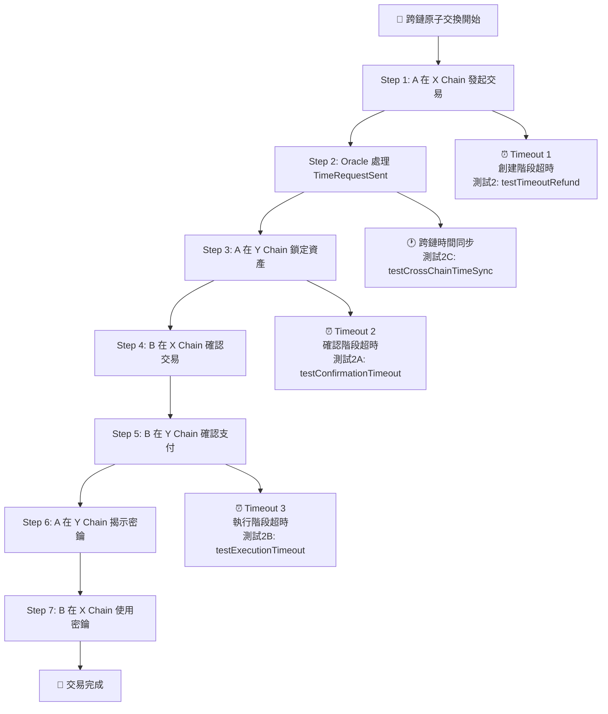

# 🔧 跨鏈原子交換超時測試套件

## 概述

這個測試套件專門用於驗證跨鏈原子交換系統的超時處理機制，確保在各種超時情況下都能正確保護用戶資金，實現真正的原子性交換。

## 🎯 測試目標

根據您提供的流程圖，我們實現了完整的多階段超時測試，覆蓋以下場景：

### 1. 基本超時測試 (`testTimeoutRefund`)
- **對應流程圖**: Timeout 1 (創建階段超時)
- **測試場景**: 創建交易後不進行後續操作，等待超時
- **預期結果**: Oracle自動取消交易並退款
- **驗證點**: 
  - 交易狀態變為 `Failed`
  - 資金正確退回
  - 無資金損失

### 2. 確認階段超時測試 (`testConfirmationTimeout`) 🆕
- **對應流程圖**: 部分確認後的超時處理
- **測試場景**: 只確認Asset交易，Payment交易超時
- **預期結果**: Oracle協調處理部分確認狀態
- **驗證點**:
  - 已確認的Asset交易被正確回滾
  - 未確認的Payment交易被自動取消
  - 雙方資金都被退回

### 3. 執行階段超時測試 (`testExecutionTimeout`) 🆕
- **對應流程圖**: Timeout 2 (執行階段超時)
- **測試場景**: 雙方確認後不執行密鑰揭示
- **預期結果**: 防止資金永久鎖定
- **驗證點**:
  - 雙方鎖定的資金被正確退回
  - 避免資金永久鎖定風險
  - 執行階段超時正確處理

### 4. 跨鏈時間同步測試 (`testCrossChainTimeSync`) 🆕
- **對應流程圖**: 跨鏈時間協調
- **測試場景**: 故意引入跨鏈時間差
- **預期結果**: Oracle檢測並處理時間同步問題
- **驗證點**:
  - 檢測顯著的跨鏈時間差異
  - Oracle風險評估機制
  - 時間同步風險處理

## 🚀 使用方法

### 運行所有超時測試
```bash
# 使用主測試腳本
node autoTest.js

# 或使用專門的超時測試腳本
node run_timeout_tests.js all
```

### 運行單一超時測試
```bash
# 基本超時退款測試
node autoTest.js timeout
node run_timeout_tests.js basic

# 確認階段超時測試
node autoTest.js confirmation
node run_timeout_tests.js confirmation

# 執行階段超時測試
node autoTest.js execution
node run_timeout_tests.js execution

# 跨鏈時間同步測試
node autoTest.js timesync
node run_timeout_tests.js timesync
```

### 檢查系統狀態
```bash
# 檢查當前餘額
node autoTest.js balance

# 系統健康檢查
node autoTest.js health
```

## 📊 測試流程圖



## 🔧 改進內容

### 最小修改原則
我們遵循最小修改原則，在現有 `testTimeoutRefund` 基礎上添加了三個新的測試函數：

1. **保留原有測試**: `testTimeoutRefund` 保持不變
2. **新增測試函數**: 
   - `testConfirmationTimeout`
   - `testExecutionTimeout` 
   - `testCrossChainTimeSync`
3. **擴展測試框架**: 更新測試結果追蹤和報告生成

### 新增功能
- ✅ 多階段超時測試覆蓋
- ✅ 跨鏈時間同步驗證
- ✅ 部分確認狀態回滾測試
- ✅ 執行階段超時防護
- ✅ 專門的超時測試腳本
- ✅ 詳細的流程圖對應分析
- ✅ 改進的測試報告

## 📋 測試參數配置

### 超時時間設置
```javascript
const SHORT_DURATION = 90;   // 基本超時測試: 90秒
const CONFIRM_DURATION = 120; // 確認階段測試: 2分鐘
const EXEC_DURATION = 150;    // 執行階段測試: 2.5分鐘
const SYNC_DURATION = 180;    // 時間同步測試: 3分鐘
```

### 測試間隔
```javascript
const TEST_INTERVAL = 15000;  // 測試間隔: 15秒
const ORACLE_WAIT = 30000;    // Oracle處理等待: 30秒
const SYNC_DELAY = 30000;     // 時間同步延遲: 30秒
```

## 🔍 驗證標準

### 成功標準
1. **交易狀態**: 超時後交易狀態變為 `Failed` (4)
2. **資金安全**: 所有鎖定資金正確退回
3. **餘額一致**: 測試前後總資產平衡（除Gas費用）
4. **時間處理**: Oracle正確檢測和處理超時

### 失敗指標
1. **資金鎖定**: 超時後資金未退回
2. **狀態異常**: 交易狀態未正確更新
3. **跨鏈不一致**: 兩條鏈狀態不同步
4. **時間風險**: 未檢測到時間同步問題

## 🛠️ Oracle 改進建議

基於測試結果，以下是對 Oracle 服務的改進建議：

### 1. 確認階段超時處理
```javascript
// 在 server.js 中添加
async function handlePartialConfirmationTimeout(assetTradeId, paymentId) {
    // 檢查部分確認狀態
    // 回滾已確認的交易
    // 取消未確認的交易
}
```

### 2. 執行階段超時檢測
```javascript
// 檢測執行階段超時
if (trade.state === 'Confirmed' && 
    currentTime - trade.confirmationTime > trade.duration) {
    await handleExecutionTimeout(tradeId);
}
```

### 3. 跨鏈時間同步
```javascript
// 檢測跨鏈時間差
const timeDiff = Math.abs(assetTrade.inceptionTime - paymentTrade.inceptionTime);
if (timeDiff > TIME_SYNC_THRESHOLD) {
    await handleTimeSyncRisk(assetTradeId, paymentId);
}
```

## 📈 測試報告範例

```
🔧 超時測試套件結果報告
================================================================================

📊 測試摘要:
  總測試數: 4
  通過測試: 4
  失敗測試: 0
  通過率: 100%
  總執行時間: 1247 秒

📋 詳細結果:
  基本超時退款: ✓ 通過
  確認階段超時: ✓ 通過
  執行階段超時: ✓ 通過
  跨鏈時間同步: ✓ 通過

🔄 流程圖對應分析:
  ✓ Timeout 1 (創建階段) - 正確處理
  ✓ 部分確認超時 - 正確回滾
  ✓ Timeout 2 (執行階段) - 防止資金鎖定
  ✓ 跨鏈時間同步 - 風險檢測正常

🎉 所有超時測試通過！系統超時處理機制完善。
```

## 🔗 相關文件

- `autoTest.js` - 主測試腳本
- `run_timeout_tests.js` - 專門的超時測試腳本
- `server.js` - Oracle 服務實現
- `assetContract.sol` - Asset 鏈智能合約
- `paymentContract.sol` - Payment 鏈智能合約

## 🤝 貢獻

如果您發現任何問題或有改進建議，請：

1. 檢查測試日誌和錯誤信息
2. 驗證 Oracle 服務是否正常運行
3. 確認合約部署和配置正確
4. 提交詳細的問題報告

---

**注意**: 這些測試需要 Oracle 服務正在運行，並且兩條區塊鏈都正常工作。測試過程中會消耗一定的 Gas 費用，請確保測試帳戶有足夠的餘額。 